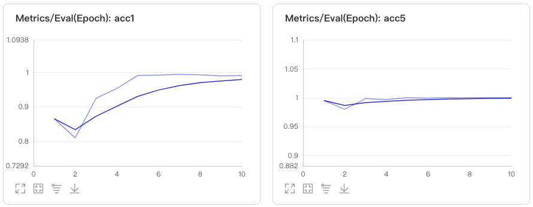

# VisualDL可视化训练指标
在使用PaddleX训练模型过程中，各个训练指标和评估指标会直接输出到标准输出流，同时也可通过VisualDL对训练过程中的指标进行可视化，只需在调用`train`函数时，将`use_vdl`参数设为`True`即可，如下代码所示，
```
model = paddlex.cls.ResNet50(num_classes=1000)
model.train(num_epochs=120, train_dataset=train_dataset,
            train_batch_size=32, eval_dataset=eval_dataset,
            log_interval_steps=10, save_interval_epochs=10,
            save_dir='./output', use_vdl=True)
```

模型在训练过程中，会在`save_dir`下生成`vdl_log`目录，通过在命令行终端执行以下命令，启动VisualDL。
```
visualdl --logdir=output/vdl_log --port=8008
```
在浏览器打开`http://0.0.0.0:8008`便可直接查看随训练迭代动态变化的各个指标（0.0.0.0表示启动VisualDL所在服务器的IP，本机使用0.0.0.0即可）。

在训练分类模型过程中，使用VisualDL进行可视化的示例图如下所示。

> 训练过程中每个Step的`Loss`和相应`Top1准确率`变化趋势：


> 训练过程中每个Step的`学习率lr`和相应`Top5准确率`变化趋势：


> 训练过程中，每次保存模型时，模型在验证数据集上的`Top1准确率`和`Top5准确率`：

